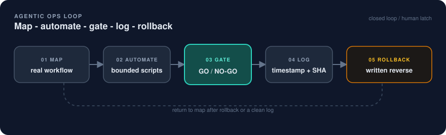
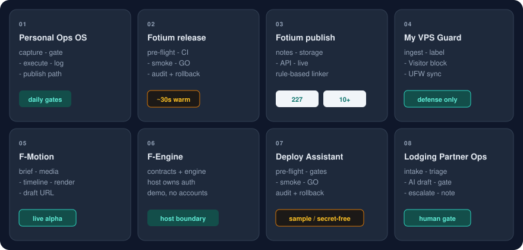

  

# Ivan Pruss - Agentic Ops

**I reduce operational chaos with AI + systems.**

This is the public portfolio for hiring conversations. It is a landing page plus case studies, not a product app.

  <a href="#selected-work">Selected work</a> ·
  <a href="#how-i-work">How I work</a> ·
  <a href="docs/positioning.md">Positioning</a> ·
  <a href="docs/visual-system.md">Visual system</a> ·
  <a href="#contact">Contact</a>

## About

- I build reliable automations (AI + scripts + integrations) that turn messy workflows into clean execution.
- I design process and tooling with logs, gates, and rollback. No hope-driven ops.
- I translate between business and technical stakeholders. Multilingual: Hebrew, Russian, English, Czech.

## The loop

Hiring scan: the same five moves on every case study.

  

Mermaid source for the same loop lives in the [visual system](docs/visual-system.md#editable-source-mermaid).

## Selected work

  

| Case study | Problem | Result | Diagram |
|---|---|---|---|
| [Personal Ops OS](case-studies/personal-ops-os.md) | Knowledge and tasks lived in side-of-desk rituals | Repeatable knowledge-to-execution loop with gates and quieter signals | [schematic](docs/diagrams/personal-ops-os.svg) |
| [Fotium release discipline](case-studies/fotium-release-discipline.md) | Manual deploys with no audit trail | Gated deploy path: pre-flight, CI gates, smoke, GO/NO-GO, timestamped reports, one-command rollback | [schematic](docs/diagrams/fotium-release-discipline.svg) |
| [Fotium publish + auto-linking](case-studies/content-automation.md) | Internal linking and publish busywork were manual | Measured production run: **227** internal links generated across **10+** content items | [schematic](docs/diagrams/fotium-publish-autolinking.svg) |
| [My VPS Guard](case-studies/my-vps-guard.md) | Fragmented host visibility; IP blocks were tribal SSH | Defensive dashboard with Caddy ingest and UFW-synced Visitor blocks (~1 min). Attempts are logged, not auto-banned | [schematic](docs/diagrams/my-vps-guard.svg) |

Related public code:

- Private application: `ivanillka/my-vps-guard` (defensive VPS security dashboard; not public)
- [f-motion](https://github.com/ivanillka/f-motion) - architecture, product design contract, CI gates, and hosted/self-host runbooks
- [f-engine](https://github.com/ivanillka/f-engine) - host-neutral vertical-video engine and reference application
- [Weekly pulse example](ops/digests/2026-09-09-weekly-pulse.md) - engineering digest, triage scripts, and follow-up action log from this repo

Sample artifacts in this repo:

- [Case study index](case-studies/README.md)
- [Positioning one-pager](docs/positioning.md)
- [Brand kit](docs/brand/BRAND.md)
- [Visual system](docs/visual-system.md)
- [Deploy Assistant pattern](deploy-assistant/README.md)

## How I work

I treat operations as a product: explicit gates, written evidence, and a rollback path before the GO.

1. **Gates.** Lint, types, tests, Playwright, and smoke checks run before anything is called production. Failures stop the path. They are not swallowed.
2. **Logs.** Every run leaves a timestamped record: what ran, which SHA, who decided GO or NO-GO, and what to do if it breaks.
3. **Rollback.** A deploy is not done until the reverse command is written next to the SHA that went out.
4. **Enablement.** Scripts and SOPs should be runnable by someone else. If only I can run it, it is not an operating system yet.

The `ops/` folder in this repository is a small public example of that cadence: a weekly pulse, a written action log, and scripts that fail closed when write access is missing.

## What I am looking for

Ops / Automation Engineer · Product Ops · TPM · Solutions Engineer · Agentic Ops / AI Ops

I am most useful where messy workflows, AI tooling, and delivery reliability meet. I want to sit close to the system of work, not only the tickets.

## Contact

- GitHub: [github.com/ivanillka](https://github.com/ivanillka)
- Location: EU / remote
