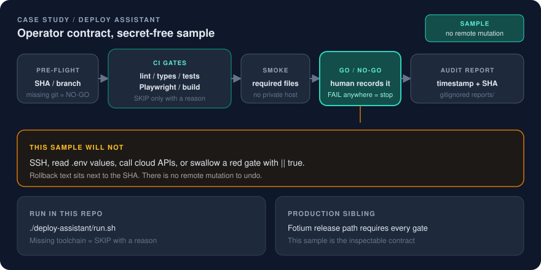

# Deploy Assistant

A secret-free operator contract: pre-flight, gates, smoke, GO / NO-GO, audit report, rollback text.

<p align="center">
  
</p>

## Problem

Deploys that live in chat cannot be handed over. The sequence is in someone's head. Gates get swallowed with `|| true`. Rollback is reconstructed after the break.

Hiring readers also cannot SSH into a private production host. If the only evidence is “we have a gated path,” it is not inspectable.

## Fix

I published **Deploy Assistant** in this portfolio as a runnable sample of the same operator contract used on the [Fotium release](fotium-release-discipline.md) path. It does not deploy. It shows the document a deploy must leave behind.

| Step | What it proves |
|---|---|
| **Pre-flight** | Git SHA, branch, clean/dirty tree. Missing git is a NO-GO. |
| **Gates** | lint, types, tests, Playwright, build. A missing tool is `SKIP` with a written reason, not a silent pass. A non-zero exit is `FAIL` and the decision becomes NO-GO. |
| **Smoke** | In this sample: required files exist (`README.md`, `report-template.md`, `run.sh`). In a real path: a known-good health check. This runner never calls a private host. |
| **GO / NO-GO** | Recorded in the report. Automation can recommend. It cannot shrug. |
| **Audit + rollback** | Markdown under `deploy-assistant/reports/` with timestamp, SHA, gate table, decision, and rollback text next to the candidate SHA. |

Public artifacts in this repo:

- [Sample README](../deploy-assistant/README.md)
- [Report template](../deploy-assistant/report-template.md)
- [Example report](../deploy-assistant/example-report.md) (fixture SHA, not a production host)
- [Runner](../deploy-assistant/run.sh) — `set -euo pipefail`; does not swallow a red gate

```sh
./deploy-assistant/run.sh
```

Generated reports are gitignored so a local run does not leak machine paths into a commit.

Adjacent public evidence, not this sample pretending to be production:

- F-Motion CI `verify` (lint, tests, build, Pages artifact, Playwright) and hosted smoke / promote-last-good rollback — [F-Motion](f-motion.md)
- Fotium production-lab operator path — [Fotium release discipline](fotium-release-discipline.md)

## Result

A hiring reader can run the contract without credentials:

- a deploy is a document (SHA, gates, decision, rollback), not a chat message
- `SKIP` is explicit; `|| true` is not how a missing linter is recorded
- rollback text is copied from the report; this sample made no remote mutation to undo

The runner uses `set -euo pipefail`. Failures are loud.

## Limits (kept honest)

- This is a **sample contract**, not a production deployer. It does not SSH, read `.env` files, call cloud APIs, or print secret values.
- This portfolio repo has no app toolchain, so lint / types / tests / Playwright / build are documented skips. A production Fotium path does not treat a missing gate as a pass.
- The ~30 second figure in the [Fotium release](fotium-release-discipline.md) case study is operator-path timing for that gated sequence once checks are warm. It is not a benchmark of `./deploy-assistant/run.sh`.
- Example report SHA and timestamps are fixtures. I am not publishing hostnames or local machine paths.

## Why this matters for hiring

Release discipline is Product Ops with production consequences. The portable artifact is the contract someone else can run at 11pm: gates, evidence, reverse command. This page is that contract with the secrets stripped.

Related public pages:

- [Fotium release discipline](fotium-release-discipline.md)
- [F-Motion](f-motion.md)
- [F-Engine](f-engine.md)
- [Case study index](README.md)
- [Positioning](../docs/positioning.md)
- [Diagram](../docs/diagrams/deploy-assistant.svg)
- [Visual system](../docs/visual-system.md)
- Landing: [README](../README.md)
