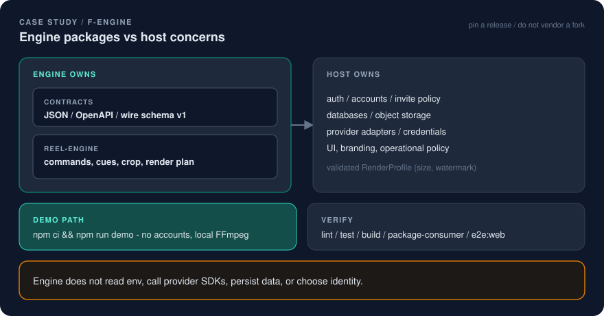

# F-Engine

Host-neutral deterministic vertical-video engine, with a reference app you can actually run.

<p align="center">
  
</p>

## Problem

A reel renderer that is also the product cannot be reused. Branding, accounts, object storage, and provider SDKs leak into crop math. The next host then vendors a fork, patches secrets into the engine, and every shared bug has to be fixed twice.

That is an ops problem as much as an architecture problem:

- **No host boundary.** Engine code reads env vars, calls provider SDKs, and chooses presentation identity.
- **No deterministic contracts.** Clients import TypeScript internals instead of a versioned HTTP/JSON boundary.
- **No demo path.** “Clone and run” still needs the maintainer's database and API keys.
- **No verify command.** Integration is hope, plus a private staging host nobody else can see.

## Fix

I published **F-Engine** as the upstream for neutral reel behavior: [ivanillka/f-engine](https://github.com/ivanillka/f-engine) (Apache-2.0). Reusable contracts and render planning stay on one side of the wall. Product identity stays on the other.

| Side | Owns |
|---|---|
| **Engine** | `@f-engine/contracts` (versioned JSON/OpenAPI, wire schema v1) and `@f-engine/reel-engine` (deterministic commands, cues, crop math, render planning). Validates a host-supplied `RenderProfile` before FFmpeg arguments exist. |
| **Host** | Authentication, databases, object storage, provider credentials and adapters, UI and branding, operational policy, a validated render profile (width/height, optional watermark). |

The engine does **not** read environment variables, call provider SDKs, persist data, or choose presentation identity. Provider adapters stay in the host. No engine API receives credentials, account objects, database handles, or branding bundles.

Private hosts pin a reviewed F-Engine release and adapt at the package/API boundary. They do not edit a vendored fork. Shared bugs are reduced to a neutral fixture, fixed upstream, then consumed through a pin update.

npm workspaces remain `"private": true`. Package names are local boundaries and tarball verification, not a registry product.

**Self-host / demo path** (from the public README):

1. **Try it with no accounts.** `npm ci` then `npm run demo`. Open `http://127.0.0.1:4173`. In-memory API, session-only test identity, local fixture media, local FFmpeg. No Supabase, cloud storage, Pexels, or hosted database.
2. **Self-host with your own services.** Follow `docs/getting-started.md`. You create and control Supabase, PostgreSQL, S3-compatible storage. No maintainer credential or private API endpoint is included. AI generation is deliberately not implemented in this engine repo.

**Verify:**

```sh
npm run lint
npm test
npm run build
npm run test:package-consumer
npm run test:e2e:web
```

Clients consume the HTTP/SSE and JSON/OpenAPI boundary. They do not import the TypeScript engine directly. Stored project and command payloads remain wire schema version 1. A stale `base_revision` is rejected; the API never auto-merges client edits.

The product host that sits on this boundary is [F-Motion](f-motion.md): studio UI, BYOK providers, agent CLI/MCP, hosted and VPS runbooks. Those concerns stay out of the engine packages.

## Result

A boundary you can draw, clone, and check:

- engine packages vs host concerns are written, not implied
- `npm run demo` is a real path with no personal credentials
- verify commands exist in-repo (lint, unit/workspace tests, build, package-consumer, Playwright web E2E)
- F-Motion can add BYOK FAL and an agent draft URL without teaching the engine about API keys

This is architecture as ops: pin, adapt, verify. Do not fork the renderer to change the watermark.

## Limits (kept honest)

- The public `f-engine` repo is the sanitized engine + reference host. It is not a hosted customer service and not a paid registry package.
- GitHub Actions are not configured on that repo. Verify is the command list above, plus the reference E2E path. Do not read “public repo” as “green default-branch badge.”
- Reference journey: short brief, user-owned media or licensed Pexels in a full host, accurate vertical preview. AI generation is a **host** feature (see F-Motion BYOK), not an engine feature.
- I am not publishing maintainer credentials, production domains, or customer data. The README's `127.0.0.1:4173` demo is the intended try-it URL.

## Why this matters for hiring

This is the systems half of Agentic Ops: draw the trust boundary first, keep secrets on the host side, and leave a demo plus verify commands so someone else can prove it without a Slack intro.

Related public pages:

- [F-Motion](f-motion.md)
- [Deploy Assistant](deploy-assistant.md)
- [Fotium release discipline](fotium-release-discipline.md)
- [Case study index](README.md)
- [Positioning](../docs/positioning.md)
- [Diagram](../docs/diagrams/f-engine.svg)
- [Visual system](../docs/visual-system.md)
- Public repo: [ivanillka/f-engine](https://github.com/ivanillka/f-engine)
- Landing: [README](../README.md)
