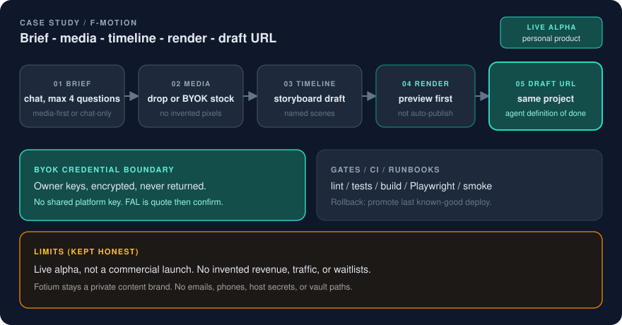

# F-Motion

AI-assisted vertical video: chat brief → media → timeline → render → draft URL.

  

## Problem

Vertical-video creation is usually a pile of tools with no operator contract: a chat that invents pixels, a timeline that only the last person understands, and credentials sitting in a shared `.env`.

That fails in the same places Product Ops fails:

- **No gates.** A fluent script looks finished. It is not a preview, and it is not a draft someone else can open.
- **No credential boundary.** Stock search and generation keys become platform secrets. Spend and quota cannot be attributed to an owner.
- **No runbook.** Hosted deploy, self-host, and “try it locally” are remembered sequences, not checkable paths.
- **Agents stop at a file.** A rendered MP4 without a project URL is a dead end. Selective edits have nowhere to go.

This page describes the public product. Fotium is a private content brand and is not this case study.

## Fix

I specified and shipped **F-Motion** as a standalone creation product ([f-motion.com](https://f-motion.com), public repo [ivanillka/f-motion](https://github.com/ivanillka/f-motion)). Creation is a gated loop, not a chatbot with a render button.

| Layer | What it proves |
|---|---|
| **Brief** | Create is the chat. Media-first or chat-only. At most four missing questions (intent, placement, length, visuals). Overlay, crop, music, and voice-over stay in the storyboard. |
| **Media** | Dropped files or licensed stock. Local inspect is advisory. The worker still quarantines and inspects bytes after upload. Incomplete boards do not invent pixels. |
| **Timeline** | A storyboard draft with named scenes. The first output is a **preview**, never an auto-published post. |
| **Render** | Preview costs one host render unit; final costs two. Host metering is separate from provider spend. |
| **Draft URL** | Every successful compose returns `/app/?project={id}` for the **same** project. Keep the file, change one scene, or open the studio. |

**BYOK credential boundary.** Pexels and FAL are owner-scoped. Each signed-in user connects their own keys in Settings. The API encrypts them and returns last-four metadata only — never the secret. The host does not supply a shared provider key and does not silently fall back to another account. FAL stills and image-to-video require quote → confirm before the owner's account is charged. A missing key makes generation unavailable, not “we will use ours.”

**Agent loop.** Cursor MCP, the `fmotion` CLI, and the studio Create page share `/v1`. `compose_reel` (or `POST /v1/compose`) returns a preview when every scene has ready media **and** a `draft_url`. Chat-only is valid: if there is no media yet, the agent still returns the draft. Result-only bulk purges the project after download; it does not promise a draft pile.

**Gates, CI, deploy.** Public evidence in the product repo:

- CI `verify` runs lint, tests, build, Pages artifact checks, and Playwright web E2E before merge (mobile analyze/test/APK on that same workflow).
- Hosted deploy runbooks require smoke (`/api/healthz`) after deploy. If Pages or same-origin smoke fails, roll back by promoting the last known-good production deployment, then re-smoke.
- Self-host: `npm run demo` with no accounts, or `./install.sh` for a one-box VPS. Secrets stay in protected env; they are never committed.

The secret-free sample of that deploy habit in *this* portfolio is [Deploy Assistant](deploy-assistant.md). The reusable engine underneath the studio is [F-Engine](f-engine.md).

## Result

A public, runnable product path:

1. Brief (chat or dropped media)
2. Attach or search media (BYOK stock when connected)
3. Storyboard timeline
4. Preview render (not a published post)
5. Draft URL for selective edits

Live alpha changelog in the product repo records the same loop: vertical storyboard drafts, BYOK Pexels, optional BYOK FAL stills, Create-as-chat, agent compose that returns a draft.

What changed in practice:

- an agent that cannot return a draft URL has not finished the job
- provider spend is the user's account, after an explicit confirm
- a red CI gate or a failed smoke is a stop, not a workaround in the Vite proxy

## Limits (kept honest)

- This is a **personal product / live alpha**, not a commercial launch, GA, or audited revenue story. I am not publishing customer counts, waitlists, or traffic.
- Music generation and direct social publishing are out of the MVP. Estimated cost and confirmation appear before paid generation.
- Hosted studio admission is invite-only. Uninvited accounts are denied. That is an access gate, not a market-size claim.
- Adjacent Fotium application code stays private. Partner import exists as a host recipe; this page does not describe private CMS internals.

## Why this matters for hiring

This is Agentic Ops on a product: bounded agent work, a credential trust boundary, CI that fails closed, and a draft URL as the definition of done.

Related public pages:

- [F-Engine](f-engine.md)
- [Deploy Assistant](deploy-assistant.md)
- [Fotium release discipline](fotium-release-discipline.md)
- [Case study index](README.md)
- [Positioning](../docs/positioning.md)
- [Diagram](../docs/diagrams/f-motion.svg)
- [Visual system](../docs/visual-system.md)
- Public repo: [ivanillka/f-motion](https://github.com/ivanillka/f-motion)
- Landing: [README](../README.md)
