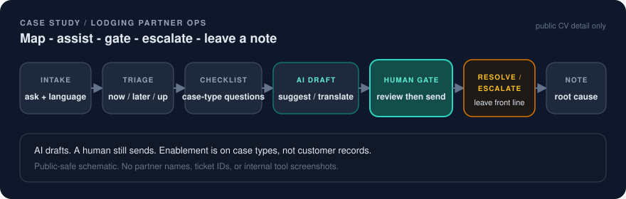

# Lodging Partner Ops

Triage, enablement, and gated escalations — employment case study, public CV detail only.

  

Employment case study: structured partner operations under volume, with AI assist behind a human gate.

## Problem

Lodging-partner support mixes languages, incomplete context, and actions that are hard to undo. Without a shared operating path, quality depends on who is on the queue that hour. Drafting and translation burn time that should go to judgment and escalations.

## Context

- **Role:** Lodging Partner Associate II at Expedia Group (Prague), Oct 2022–present
- **Scope:** lodging partners across regions; Hebrew and English day-to-day
- **Work at category level:** onboarding friction, self-serve partner tooling help, content/rates/finance inquiries, technical escalations

This page stays at public CV detail. It does not describe confidential partner data, internal metrics, or proprietary policy.

## Fix

I treated partner ops like a product path:

| Step | What it does |
|---|---|
| **Intake** | Capture the ask and language; separate noise from a real case |
| **Triage** | Answer now vs investigate vs escalate |
| **Checklist** | Recurring case types get the same questions so handoffs keep context |
| **AI draft assist** | Suggested replies and translation for speed and tone |
| **Human gate** | A person reviews and sends; AI does not auto-commit |
| **Resolve or escalate** | Clear path when the case leaves the front line |
| **Knowledge note** | Short root-cause note so the next person is not starting from zero |

Team enablement sat next to personal use: prompting playbooks, workflow shortcuts, and live examples on *case types* (not customer records), plus explicit when-to-use / when-not rules so AI does not invent policy.

## Result

- Teammates adopted AI for drafting and case handling in daily work (qualitative; no internal KPI published here)
- Faster, more consistent written partner communication on recurring case types
- Same transferable habit as the lab case studies: gates, written evidence, calm escalations under volume

No ticket volumes, SLA percentages, CSAT scores, or partner counts are claimed on this page.

## Limits (kept honest)

- This is front-line and enablement work inside a large company, not a claim that I owned the global partner platform.
- AI is an assist layer with a human send gate, not autonomous partner messaging.
- Employer name is already public on my CV. Everything else on this page is category-level and non-confidential.

## Why this matters for hiring

The rest of this portfolio shows systems I built myself. This page is the stakeholder proof: other people depended on the path. It is Product Ops / Agentic Ops in a live queue — map the work, assist with AI, gate irreversible actions, leave a note.

## Never publish with this page

- Partner / hotel / property names or IDs
- Ticket IDs, queue exports, or screenshots of internal tools
- Internal SLAs, CSAT, AHT, volumes, margins, or recontracting rules
- Proprietary policy text or unreleased product details
- Real customer PII

Related public pages:

- [Personal Ops OS](personal-ops-os.md) (same habit: gated operator loop)
- [F-Motion](f-motion.md) (same habit: AI drafts, a human still decides)
- [Case study index](README.md)
- [Positioning](../docs/positioning.md)
- [Diagram](../docs/diagrams/lodging-partner-ops.svg)
- [Visual system](../docs/visual-system.md)
- Landing: [README](../README.md)
