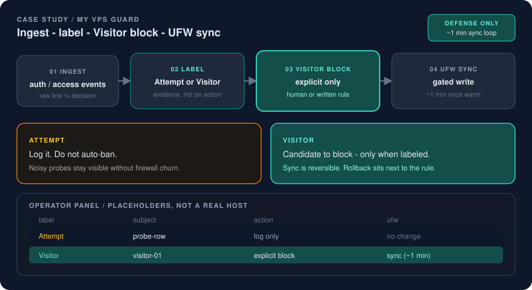

# My VPS Guard — defensive edge ops

From "we hope the server is fine" to a password-gated security dashboard with real access-log ingest and host firewall sync.

  

## Problem

A single Hetzner VPS ran many services (web apps, automation, ops dashboards) behind Caddy and Tailscale. Visibility into inbound trouble was fragmented:

- access logs lived on the host but were not turned into an operator view
- blocking an abusive IP meant hand-editing firewall rules with no product UI
- there was no shared catalog of sites/services for filtering events
- "security tooling" discussions easily drift into offense. The need was **defense and ops evidence**, not scanning or exploitation

Without a control surface, response was memory and SSH.

## Fix

I specified and shipped **My VPS Guard**: a defensive multi-site security ops dashboard (Next.js / TypeScript) meant to sit on the same VPS as the apps.

| Layer | What it does |
|---|---|
| **Operator UI** | Password-gated Overview, Live, Logs, Attempts, Visitors, Sites, checklist posture |
| **Ingest** | First-party Caddy JSON access logs shipped into Guard (no outbound scanning) |
| **Detection** | Labels inbound patterns already hitting the host: failed logins, path probes, rate bursts, error spikes |
| **Visitor control** | Block / allow / rate-limit IPs in the UI |
| **Edge enforce** | Timer syncs Visitor **blocks** into host UFW (skips localhost, private, and Tailscale ranges) |
| **Ops surface** | Listed on the existing Tailscale ops homepage next to other services |

Public adjacent evidence in this portfolio repo stays secret-free. The application repository is private (`ivanillka/my-vps-guard`), same honesty rule as other product case studies: describe the operating pattern, do not publish hostnames, credentials, or internal IPs here.

The diagrammatic operator panel on this page uses placeholders (`probe-row`, `visitor-01`). It is not a screenshot of a real host.

Design constraints I kept explicit:

- defensive only (no exploit payloads, no attack scanners)
- Guard listens on localhost behind reverse proxy / Tailscale serve
- session cookies configured for the real access path (HTTP on Tailscale vs HTTPS)
- ingest uses a bearer token; operator password is hashed in production env
- Auto-block of every Attempt is not the default. Explicit Visitor blocks drive UFW sync.

## Result

A single defensive control surface for the VPS:

- real Caddy traffic appears in Live / Logs / Attempts after log ship is running
- an operator can block an IP in the UI and have UFW deny it on the host within about a minute
- multi-site catalog (product sites + internal services) for filtering
- documented ops note and homepage tile so the path is findable, not tribal knowledge

This is personal/production-lab scale security ops, not a claim about enterprise SOC coverage or zero false positives. The ~1 minute figure is operator-path timing for the sync loop, not an SLA.

## Limits (kept honest)

- Auto-block of every Attempt is not the default. Explicit Visitor blocks drive UFW sync (safer than silent mass bans).
- Posture checklist modules still use a sample adapter until more host checks are wired.
- Private application code is not browsable without access to the private repo.
- Tailscale and Caddy topology are environment-specific. The portable part is the pattern: ingest → label → human decision → firewall sync → audit trail in the product.
- I am not publishing real IPs, hostnames, or local machine paths.

## Why this matters for hiring

This is Agentic / Product Ops with a security boundary: turn raw host signals into a gated operator loop, keep offense out of scope, and leave a path someone else can run.

Related public pages:

- [Case study index](README.md)
- [Personal Ops OS](personal-ops-os.md) (same habit: gated operator loop)
- [Fotium release discipline](fotium-release-discipline.md) (same habit: gates and evidence)
- [Positioning](../docs/positioning.md)
- [Diagram](../docs/diagrams/my-vps-guard.svg)
- [Visual system](../docs/visual-system.md)
- Landing: [README](../README.md)
