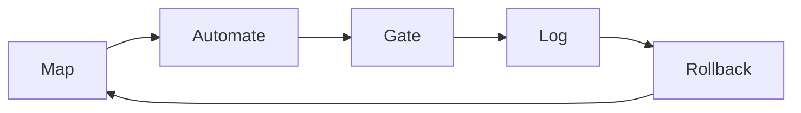
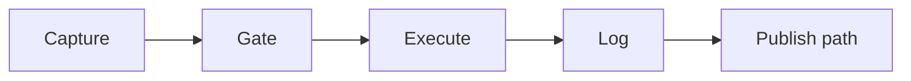
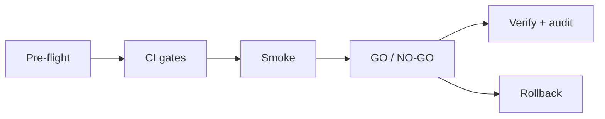
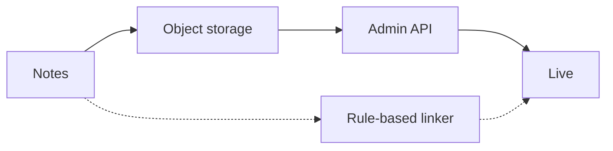
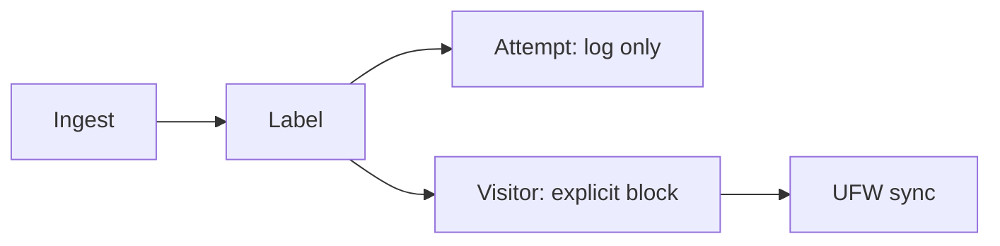
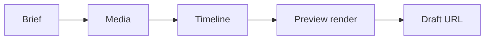
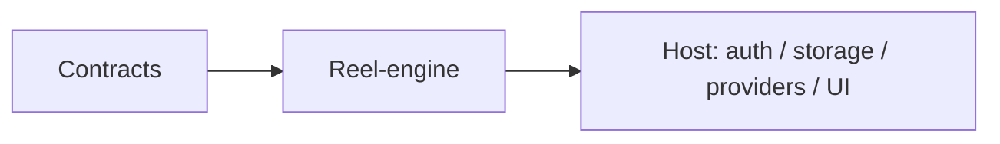
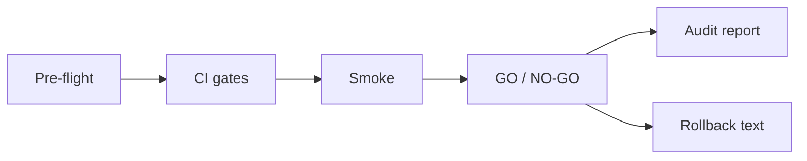

# Visual system

How diagrams are used on this public portfolio. Pair with the [brand kit](brand/BRAND.md).

This is a landing page plus case studies, not a product app. Visuals exist so a hiring reader can scan the operating idea in a few seconds, then read the honest limits.

## What gets a diagram

| Surface | Asset | Why |
|---|---|---|
| README hero | [brand/logo-lockup.svg](brand/logo-lockup.svg) | Name + mark before the one-liner |
| README loop | [diagrams/agentic-ops-loop.svg](diagrams/agentic-ops-loop.svg) | Shared method: map → automate → gate → log → rollback |
| README selected work | [diagrams/selected-work.svg](diagrams/selected-work.svg) | Seven cards (two rows), then the table for detail |
| [Personal Ops OS](../case-studies/personal-ops-os.md) | [diagrams/personal-ops-os.svg](diagrams/personal-ops-os.svg) | Daily gate between capture and action |
| [Fotium release](../case-studies/fotium-release-discipline.md) | [diagrams/fotium-release-discipline.svg](diagrams/fotium-release-discipline.svg) | Operator contract + rollback band |
| [Fotium publish](../case-studies/content-automation.md) | [diagrams/fotium-publish-autolinking.svg](diagrams/fotium-publish-autolinking.svg) | Two layers + **227** / **10+** chips |
| [My VPS Guard](../case-studies/my-vps-guard.md) | [diagrams/my-vps-guard.svg](diagrams/my-vps-guard.svg) | Defense-only; Attempt is not auto-ban |
| [F-Motion](../case-studies/f-motion.md) | [diagrams/f-motion.svg](diagrams/f-motion.svg) | Brief → media → timeline → render → draft URL |
| [F-Engine](../case-studies/f-engine.md) | [diagrams/f-engine.svg](diagrams/f-engine.svg) | Engine packages vs host concerns |
| [Deploy Assistant](../case-studies/deploy-assistant.md) | [diagrams/deploy-assistant.svg](diagrams/deploy-assistant.svg) | Secret-free sample; SKIP only with a reason |

Every case-study page embeds its diagram near the top and links back to this system and the README.

## Node language

Same shapes on every schematic:

- **Slate panel** — a step (map, ingest, smoke, log).
- **Teal fill + teal stroke** — a gate or an explicit decision (GO / NO-GO, Visitor block, live hop).
- **Amber outline** — rollback, fail-closed, or “do not auto-ban.”
- **Paper chip** (`#F1F5F9` on `#0F172A`) — a metric that already exists in the repo.

Do not invent a fifth accent. Do not use screenshots of real hosts. If a dashboard is required, draw a placeholder panel (`probe-row`, `visitor-01`).

## Editable source (Mermaid)

Committed SVGs are the hiring render. Mermaid below is the same loop, for editors who want to change copy before redrawing the SVG.

Personal Ops OS:

Fotium release:

Fotium publish:

My VPS Guard (defense only):

F-Motion:

F-Engine:

Deploy Assistant:

## How to add a diagram

1. Draw on the shared canvas: `880×` height, `rx=16`, fill `#0F172A`.
2. Put tokens only from [brand/BRAND.md](brand/BRAND.md).
3. Add `<title>` and `<desc>` on the SVG root (accessible name + the operating idea).
4. Embed with a relative path from the case-study page. Keep existing case-study filenames stable so inbound links do not break.
5. If you add a metric, it must already be written in a case study. Do not decorate with traffic, SLA, or block-count fiction.

## What never appears in a visual

- Email, phone, LinkedIn, or other PII
- Real hostnames, private IPs, credentials, `.env` values
- Offensive security steps, payloads, or exploit panels
- Neon “startup” gradients

Contact stays GitHub + EU/remote only, including inside SVG subtitle text.
